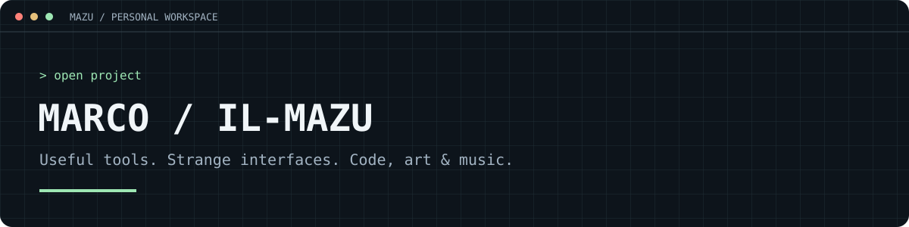
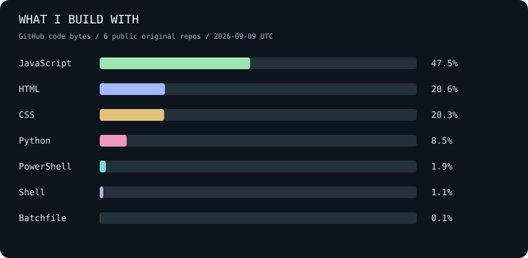

# Hey, I'm Marco.

Computer science student building practical tools and web experiments. I like software that solves a specific problem—and interfaces with a little personality.

**[Explore my desktop →](https://mazu.is-a.dev)** · **[Browse my projects](https://github.com/Il-Mazu?tab=repositories)**

## Pick something to explore

| Project | What you can do with it | Built with |
| :--- | :--- | :--- |
| **[Mazu-space](https://github.com/Il-Mazu/Mazu-space)** | Explore a retro desktop with draggable windows, music, a blog and CRT effects. **[Open website ↗](https://mazu.is-a.dev)** | React · Vite |
| **[BibliotecAPP](https://github.com/Il-Mazu/BibliotecAPP)** | Browse a library, reserve available books and manage a catalog with Open Library metadata. | React · Express · MongoDB |
| **[Discogs Auto Pricer](https://github.com/Il-Mazu/il-capitalista)** | Reprice an inventory CSV using Discogs suggestions, then review a separate change report. | Python |
| **[Blitz Ad Blocker](https://github.com/Il-Mazu/blitz-ad-blocker)** | Launch Blitz on Windows with domain blocking and cosmetic filtering; switch back by launching normally. | PowerShell · JavaScript |

### Smaller experiments

[CryptoFix Shop](https://github.com/Il-Mazu/Cryptofix_officialSHOP) — a merchandise storefront UI prototype.  
[Test-Engim](https://github.com/Il-Mazu/Test-Engim) — a Python interview exercise exploring random text-file mutation.

## On the workbench

Web interfaces with character, scripts that remove repetitive work, and projects around books and music.

The chart measures repository code, not proficiency. Generated from GitHub's public API; the date is shown on the chart.

## Say hello

Tried one of my tools? Open an issue in that repository with what you were trying to do and what happened. Bug reports and concrete feature ideas help me decide what to improve next.
